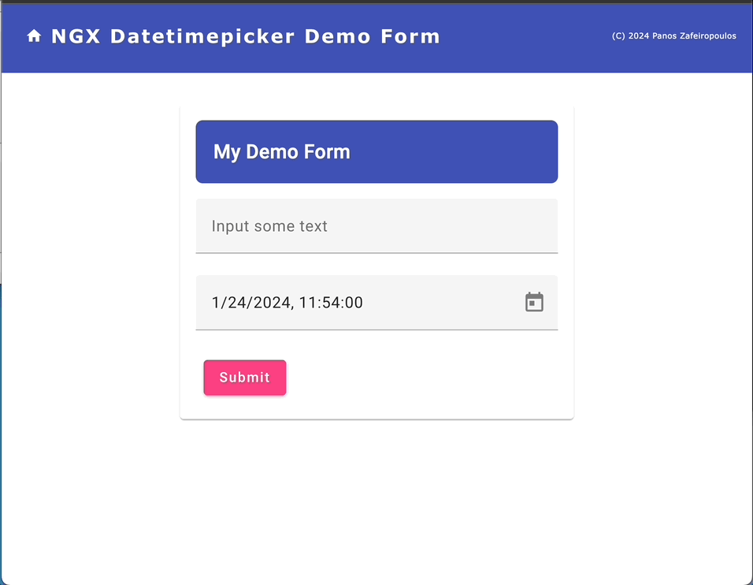

# *** Note: *** 

This repo is a demo repo using Angular/Angular material versions 15.x with the @angular-material-components/datetime-picker version 15.0.0. The datetimepicker theme inherited OK from the angular material theme and works as expected. However, till the time this repo was created, there was no any updated for the [@angular-material-components/datetime-picker](https://www.npmjs.com/package/@angular-material-components/datetime-picker), that solves the “transparency” issue with Angular/Angular material versions ^16.x. Actually, there were no updates since 6 months ago.

The repo has been created on Jan. 24, 2024.

---

#### This project has been created via the 'ngcr.sh' tool.
#### Get it at: https://github.com/zzpzaf/bash-ngrc

(C) 2024 Panos Zafeiropoulos

License: MIT

